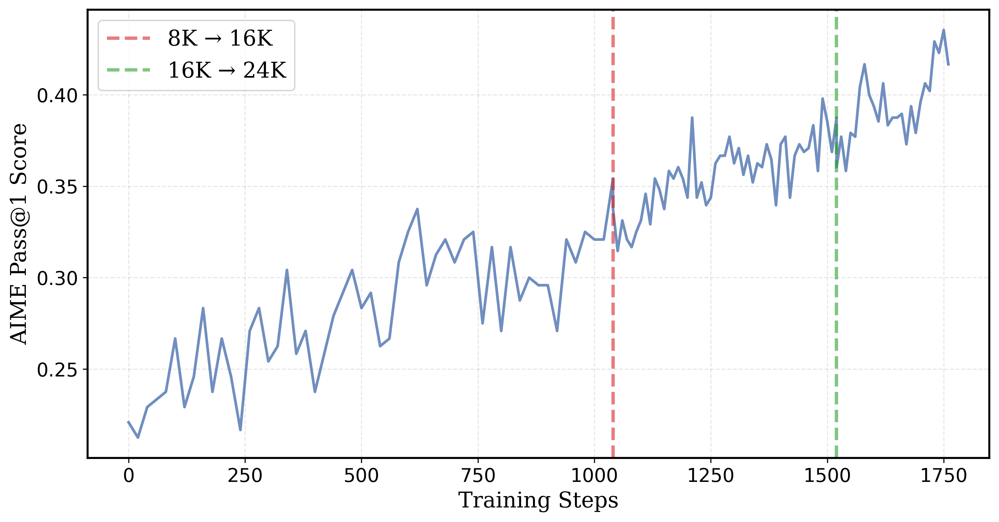

<div align="center">

# DeepScaleR

<div>
🚀 Democratizing Reinforcement Learning for LLMs 🌟
</div>
</div>
<div>
<br>

<div align="center">

[](https://github.com/agentica-project/deepscaler)
[](https://pretty-radio-b75.notion.site/DeepScaleR-Surpassing-O1-Preview-with-a-1-5B-Model-by-Scaling-RL-19681902c1468005bed8ca303013a4e2) 
[](https://x.com/Agentica_)
[](https://huggingface.co/agentica-org)

</div>

</div>


## Overview

DeepScaleR is an open-source project to fully democratize reinforcement learning (RL) for LLMs and reproduce DeepSeek R1 and OpenAI O1/O3 at scale on real tasks. For all releases, we open source all our efforts here-including training scripts (including hyperparameters), models, dataset, and logs. 



*Figure 1: DeepScaleR 1.5B model's Pass@1 accuracy on AIME2024 as RL training progresses. At step 1040 and 1520, the context length is extended to 16K and 24K. For more details, see our [blog post](https://www.notion.so/DeepScaleR-Scaling-R1-Models-with-Reinforcement-Learning-1891e65ddc7f80ad8cc6dbe0069a66fa?pvs=4).*


## Releases  📰

<strong>[2025/02/10]</strong> We release `DeepScaleR-1.5B-Preview`, a 1.5B model that surpasses O1-Preview and achieves <strong>43.1% Pass@1</strong> on AIME. We achieve this by iteratively scaling Deepseek's GRPO algorithm from 8K→16K->24K context length for thinking. As part of this release, we open-source:
- 🍗 An In-Depth Blog Post on our [Training Recipe and Insights](https://www.notion.so/DeepScaleR-Surpassing-O1-Preview-with-a-1-5B-Model-by-Scaling-RL-1891e65ddc7f80ad8cc6dbe0069a66fa)
- 🤗 HF Model [`DeepScaleR-1.5B-Preview`](https://huggingface.co/agentica-org/DeepScaleR-1.5B-Preview)
- 🤗 HF Dataset [`DeepScaleR-Preview-Dataset`](https://huggingface.co/datasets/agentica-org/DeepScaleR-Preview-Dataset) / 🗂️  [JSON Dataset](https://github.com/agentica-project/deepscaler/tree/main/deepscaler/data)
- 📄 [Training Scripts](https://github.com/agentica-project/deepscaler/tree/main/scripts/train)—Exact hyperparameters we used to achieve 43.1% on AIME.
- 📈 [Wandb Training Logs](https://wandb.ai/mluo/deepscaler-1.5b)—All training runs and ablations.
  - Due to Wandb migration bugs, the 8k training run is compressed to 400-500 steps. The data is identical, but our original run was 1600 steps.
- 🔎 [Evaluation Logs](https://drive.google.com/file/d/1V_rYKoL35WmubbmWN6PeFg4zo5QOug8X/view?pli=1)—DeepScaleR, Deepseek Distill, and Still 1.5B generations over 1000+ math problems.


## Getting Started 🎯
### Installation
```bash
# Recommend Python 3.10.
cd deepscaler
pip install -e ./verl
pip install -e .
```

### Data
Our raw training data in `deepscaler/data/[train|test]`, along with preprocessing scripts. To convert the raw data into Parquet files for training, run:
```python
# Output parquet files in data/*.parquet.
python scripts/data/deepscaler_dataset.py
```

### Training Scripts

We provide training scripts for both single-node and multi-node setups in `scripts/train/`. Our runs' Wandb logs are available [here](https://wandb.ai/mluo/deepscaler-1.5b).

#### Single-Node Training (8 GPUs)
Our 8k context script runs on a single node with 8 A100-80GB GPUs:
```bash
# Set XFormers backend to avoid CUDA errors
export VLLM_ATTENTION_BACKEND=XFORMERS
# Run 8K context length training
export MODEL_PATH="deepseek-ai/DeepSeek-R1-Distill-Qwen-1.5B"
./scripts/train/run_deepscaler_1.5B_8K.sh --model $MODEL_PATH
```

#### Multi-Node Training (32 GPUs)

Our long-context runs (16K/24K) are distributed across 4 nodes with 8 A100-80GB GPUs each. To run, follow these steps:

1. On the head node:
```bash
# Set XFormers backend to avoid CUDA errors
export VLLM_ATTENTION_BACKEND=XFORMERS
# Start Ray head node
ray start --head
```

2. On each worker node:
```bash
# Set XFormers backend to avoid CUDA errors
export VLLM_ATTENTION_BACKEND=XFORMERS
# Connect to head node (replace with your head node's address)
ray start --address=[RAY_ADDRESS]
```

3. Finally, on the head node, run the training script:
```bash
# Run 16K or 24K context length training
./scripts/train/run_deepscaler_1.5B_[16K|24K].sh
```
We welcome the community to try out different models, context legnths, and RL parameters in the training scripts!

### Ablations

Finally, we provide ablations for the 2k/4k context runs in `scripts/ablation/`. To run:
```bash
./scripts/ablation/run_deepscaler_1.5B_[2k|4k].sh
```

## Evaluation

Our evaluation scripts automatically runs vLLM to generate 16 samples for each problem. To run our evaluation scripts, run:
```bash
./scripts/eval/eval_model.sh --model [CHECKPOINT_PATH] --datasets [DATASET1] [DATASET2] --output-dir [OUTPUT_DIR]
```

We report Pass@1 accuracy averaged over 16 samples for each problem. Notably, our `DeepScaleR-1.5B-Preview` surpasses many open-source 7B models! Our evaluation logs are available [here](https://drive.google.com/file/d/1V_rYKoL35WmubbmWN6PeFg4zo5QOug8X/view?pli=1).

| Model | AIME 2024 | MATH 500 | AMC 2023 | Minerva Math | OlympiadBench | Avg. |
|-------|-----------|-----------|-----------|--------------|---------------|------|
| 2.5-7B-Instruct | 13.3 | 79.8 | 50.6 | 34.6 | 40.7 | 43.8 |
| rStar-Math-7B | 26.7 | 78.4 | 47.5 | - | 47.1 | - |
| Eurus-2-7B-PRIME | 26.7 | 79.2 | 57.8 | 38.6 | 42.1 | 48.9 |
| Qwen2.5-7B-SimpleRL | 26.7 | 82.4 | 62.5 | <strong>39.7</strong> | 43.3 | 50.9 |
| DeepSeek-R1-Distill-Qwen-1.5B | 28.8 | 82.8 | 62.9 | 26.5 | 43.3 | 48.9 |
| Still-1.5B | 32.5 | 84.4 | 66.7 | 29.0 | 45.4 | 51.6 |
| <strong>DeepScaleR-1.5B-Preview</strong> | <strong>43.1</strong> | <strong>87.8</strong> | <strong>73.6</strong> | 30.2 | <strong>50.0</strong> | <strong>57.0</strong> |
| O1-Preview | 40.0 | 81.4 | - | - | - | - |

To replicate our reported numbers for `DeepScaleR-1.5B-Preview`, run:
```bash
./scripts/eval/eval_model.sh --model agentica-org/DeepScaleR-1.5B-Preview --datasets aime math amc minerva olympiad_bench --output-dir $HOME/DeepScaleR-1.5B-Preview
```


## Acknowledgements

- Our training experiments are powered by our heavily modified fork of [Verl](https://github.com/agentica-project/verl), an open-source RLHF library.
- Our model is trained on top of [`DeepSeek-R1-Distill-Qwen-1.5B`](https://huggingface.co/deepseek-ai/DeepSeek-R1-Distill-Qwen-1.5B).
- Our work is done as part of  [Berkeley Sky Computing Lab](https://skycomputing.berkeley.edu/) and [Berkeley AI Research](https://bair.berkeley.edu/).


## Citation

```bibtex
@misc{deepscaler2025,
  title={DeepScaleR: Surpassing O1-Preview with a 1.5B Model by Scaling RL},
  author={Michael Luo and Sijun Tan and Justin Wong and Xiaoxiang Shi and William Tang and Manan Roongta and Colin Cai and Jeffrey Luo and Tianjun Zhang and Erran Li and Raluca Ada Popa and Ion Stoica},
  year={2025},
  howpublished={\url{https://pretty-radio-b75.notion.site/DeepScaleR-Surpassing-O1-Preview-with-a-1-5B-Model-by-Scaling-RL-19681902c1468005bed8ca303013a4e2}},
  note={Notion Blog}
  year={2025}
}
```
